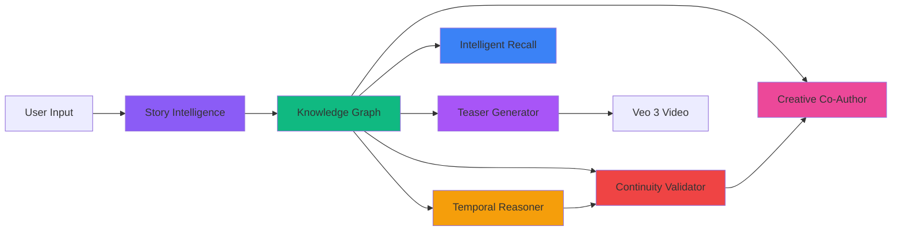

<div align="center">

# 🎬 ScriptForge AI

### *A Collaborative Storytelling Ecosystem: Beyond Generic Chatbots*

[](https://nextjs.org/)
[](https://reactjs.org/)
[](https://www.typescriptlang.org/)
[](https://ai.google.dev/)
[](https://neo4j.com/)
[](https://www.mongodb.com/)

**Purpose-Built Multi-Agent Intelligence with Intent-Aware Logic and Graph Memory**

[Features](#-key-features) • [Demo](#-live-demo) • [Installation](#-quick-start) • [Documentation](#-documentation) • [Architecture](#-architecture) • [Contributing](#-contributing)


---

</div>

## 📖 Table of Contents

- [Overview](#-overview)
- [Key Features](#-key-features)
- [Architecture](#-architecture)
- [Tech Stack](#-tech-stack)
- [Quick Start](#-quick-start)
- [Usage Guide](#-usage-guide)
- [Agent Capabilities](#-agent-capabilities)
- [API Documentation](#-api-documentation)
- [Project Structure](#-project-structure)
- [Screenshots](#-screenshots)
- [Contributing](#-contributing)
- [License](#-license)

---

## 🌟 Overview

**ScriptForge AI** is a revolutionary intelligent scriptwriting platform that goes beyond generic chatbots. It's a complete **collaborative storytelling ecosystem** powered by seven specialized AI agents, visual workflow orchestration, and a graph-based memory system.

### 🎯 The Problem

Professional screenwriters face three critical challenges:
- 📚 **Continuity Nightmares** - Tracking hundreds of story elements across multiple drafts
- 🔀 **Fragmented Tools** - Jumping between note apps, timeline software, and editing tools
- 🤖 **Generic AI Limitations** - ChatGPT doesn't understand narrative structure or your story universe

### 💡 Our Solution

ScriptForge AI provides:
- **🧠 Multi-Agent Intelligence** - Seven specialized agents working in concert
- **🎨 Visual Workflow Builder** - n8n-style drag-and-drop orchestration
- **🕸️ Knowledge Graph Memory** - Neo4j-powered relationship tracking
- **🎬 Cinematic Output** - AI-generated video teasers with Veo 3
- **📊 TOON Protocol** - Custom notation for readable AI outputs

---

## ✨ Key Features

<details open>
<summary><b>🎨 Visual Workflow Builder</b></summary>

- **Drag-and-drop** agent orchestration
- **Auto-designs** optimal pipelines based on project requirements
- **No coding** required - describe your needs in plain English
- **Semantic edges** - connections carry contextual meaning
- **Real-time execution** - watch your workflow run live

</details>

<details open>
<summary><b>🧠 Seven Specialized AI Agents</b></summary>

| Agent | Purpose | Capabilities |
|-------|---------|-------------|
| 🧠 **Story Intelligence** | The Brain | Global context, manuscript parsing, style learning |
| 🕸️ **Knowledge Graph** | The Memory | Character/location/object tracking, relationships |
| ⏰ **Temporal Reasoner** | Timeline Police | Chronology tracking, flashback detection |
| 🛡️ **Continuity Validator** | The Editor | Error detection, intent awareness |
| ✨ **Creative Co-Author** | The Muse | Plot suggestions, dialogue enhancement |
| 🔍 **Intelligent Recall** | Ask Your Story | Natural language queries, cross-referencing |
| 🎬 **Teaser Generator** | The Mic-Drop | Video generation, visual prompts |

</details>

<details open>
<summary><b>📊 TOON (Token-Oriented Object Notation)</b></summary>

Custom symbolic notation for improved AI output readability:
- `⟹` for object properties
- `→` for array indices  
- `⊤` / `⊥` for boolean values
- `∅` for undefined/null

**Better than JSON** for human interpretation while maintaining structure.

</details>

<details open>
<summary><b>🎭 Intent-Aware Continuity</b></summary>

- Distinguishes **genuine errors** from **narrative devices** (e.g., foreshadowing)
- Provides **alerts without restricting** creative freedom
- **Severity classification** - critical vs. stylistic choices
- Understands **Chekhov's Gun** and intentional mysteries

</details>

<details open>
<summary><b>☁️ FORGER Editor (Future)</b></summary>

- **Cloud-based** collaborative script editor
- **Real-time team writing** with shared knowledge graph updates
- **Version control** integration
- **Conflict resolution** with AI assistance

</details>

<details open>
<summary><b>🎥 Multimodal Context</b></summary>

- **Processes PDFs**, scripts, images, and audio
- **Connects visual and textual** references
- **Maintains context** across different media types
- **Gemini-powered** multimodal understanding

</details>

---

## 🏗️ Architecture

### System Overview


*A Collaborative Storytelling Ecosystem - Core features and capabilities*

### Technical Stack


*The Architectural Stack & Tooling - Agent swarm, data foundation, and output layers*

### Agent Pipeline



---

## 🛠️ Tech Stack

### Frontend


### Backend & AI


### Libraries & Tools
- **UI Components**: Radix UI, Framer Motion, Lucide React
- **Data Visualization**: Recharts, Force Graph (2D/3D)
- **Document Processing**: PDF-Parse, Mammoth, PDF-Lib
- **State Management**: Zustand
- **API**: REST endpoints with Next.js App Router

---

## 🚀 Quick Start

### Prerequisites

```bash
Node.js >= 18.0.0
npm >= 9.0.0
MongoDB (local or Atlas)
Neo4j Database (local or Aura)
```

### Installation

1️⃣ **Clone the repository**
```bash
git clone https://github.com/yourusername/scriptforge-ai.git
cd scriptforge-ai
```

2️⃣ **Install dependencies**
```bash
npm install
```

3️⃣ **Set up environment variables**

Create `.env.local` file:
```env
# Google Gemini AI
GOOGLE_GEMINI_API_KEY=your_gemini_api_key_here

# Database Connections
MONGODB_URI=mongodb://localhost:27017/scriptforge
NEO4J_URI=bolt://localhost:7687
NEO4J_USER=neo4j
NEO4J_PASSWORD=your_neo4j_password
NEO4J_DATABASE=neo4j

# Authentication
NEXTAUTH_SECRET=your_nextauth_secret_here
NEXTAUTH_URL=http://localhost:3000

# Optional: Video Generation (Veo 3)
VEO_API_KEY=your_veo_api_key
```

4️⃣ **Run development server**
```bash
npm run dev
```

5️⃣ **Open your browser**
```
http://localhost:3000
```

### Production Build

```bash
npm run build
npm start
```

---

## 📚 Usage Guide

### 1. Create an Account

Navigate to `/login` and sign up with email or OAuth provider.

### 2. Create Your First Workflow

```
Dashboard → Workflows → Create Workflow
```

**Example Prompt:**
```text
I'm writing a sci-fi mystery thriller about a detective investigating 
murders across parallel timelines. I need help tracking multiple timeline 
versions, ensuring chronological consistency, and managing character 
relationships.
```

**Upload Files (Optional):**
- Manuscript PDF
- Character sketches
- Reference images
- Audio notes

### 3. Visual Workflow Canvas

The AI generates an optimal workflow. You can:
- ✏️ **Edit** - Drag agents to reposition
- 🔗 **Connect** - Link agents with semantic edges
- ➕ **Add** - Drag new agents from right sidebar
- 🗑️ **Remove** - Delete unnecessary agents
- 💾 **Save** - Persist your changes

### 4. Execute Workflow

Click **"Run Campaign"** to execute. Watch agents:
- 🟡 Turn **yellow** when running
- 🟢 Turn **green** when complete
- 🔴 Turn **red** on errors

### 5. View Results

Click any agent node to see:
- **Output Tab** - Formatted markdown results
- **Result Tab** - Structured data (Formatted/JSON/TOON)
- **Input Tab** - What the agent received
- **Prompt Tab** - The AI prompt used

### 6. Explore Story Graph

Navigate to **Story Graph** to see:
- 🎭 **3D/2D visualization** of your story universe
- 🔍 **Search** for characters, locations, events
- 🎯 **Filter** by entity type
- 📊 **Statistics** on story elements

### 7. Generate Teaser Videos

Use the **Cinematic Teaser Generator** agent:
1. Extracts story essence
2. Generates trailer script
3. Creates visual prompts
4. Generates video clips with Veo 3

---

## 🤖 Agent Capabilities

### 🧠 Story Intelligence Core
**Role:** The Brain  
**Inputs:** Manuscript, Script, Documents  
**Outputs:** Story Context, Style Profile, Structure Analysis

```typescript
capabilities: [
  'Global context awareness',
  'Manuscript parsing & analysis',
  'Style & tone learning',
  'Version tracking',
  'Narrative structure detection'
]
```

### 🕸️ Story Knowledge Graph Agent
**Role:** The Memory  
**Inputs:** Story Context, Manuscript, Scenes  
**Outputs:** Knowledge Graph, Entity Data, Relationships

```typescript
capabilities: [
  'Character tracking',
  'Location mapping',
  'Object & prop tracking',
  'Event sequencing',
  'Relationship graphs',
  'Plot thread management',
  'Entity state tracking'
]
```

### ⏰ Temporal & Causal Reasoning Agent
**Role:** Timeline Police  
**Inputs:** Knowledge Graph, Story Context, Events  
**Outputs:** Timeline, Causal Chains, Temporal Issues

```typescript
capabilities: [
  'Chronology tracking',
  'Flashback detection',
  'Flash-forward analysis',
  'Cause-effect validation',
  'Timeline consistency',
  'Temporal paradox detection'
]
```

### 🛡️ Continuity & Intent Validator
**Role:** The Editor  
**Inputs:** Knowledge Graph, Timeline, Manuscript  
**Outputs:** Continuity Report, Errors, Warnings

```typescript
capabilities: [
  'Contradiction detection',
  'Intent analysis',
  'Error classification',
  'Severity assessment',
  'Continuity validation',
  'Plot hole detection'
]
```

### ✨ Creative Co-Author Agent
**Role:** The Muse  
**Inputs:** Story Context, Knowledge Graph, User Intent  
**Outputs:** Suggestions, Improved Dialogue, Plot Ideas

```typescript
capabilities: [
  'Scene suggestions',
  'Plot development ideas',
  'Dialogue enhancement',
  'Character arc guidance',
  'Theme reinforcement',
  'Creative brainstorming',
  'Alternative scenarios'
]
```

### 🔍 Intelligent Recall Agent
**Role:** Ask Your Story  
**Inputs:** Knowledge Graph, Query, Story Context  
**Outputs:** Answer, References, Related Info

```typescript
capabilities: [
  'Natural language queries',
  'Character lookups',
  'Plot searches',
  'Event retrieval',
  'Cross-referencing',
  'Contextual answers',
  'Story Q&A'
]
```

### 🎬 Cinematic Teaser Generator
**Role:** The Mic-Drop  
**Inputs:** Story Context, Knowledge Graph, Preferences  
**Outputs:** Teaser Script, Visual Prompts, Video

```typescript
capabilities: [
  'Story essence extraction',
  'Trailer script generation',
  'Visual prompt creation',
  'Video generation (Veo3)',
  'Hook creation',
  'Mood & tone capture',
  'Key moment identification'
]
```

---

## 🔌 API Documentation

### Workflow APIs

#### Generate Workflow
```http
POST /api/scriptforge/workflows/generate
Content-Type: application/json

{
  "brief": "Story description",
  "files": ["file1.pdf", "image.jpg"]
}
```

#### List Workflows
```http
GET /api/scriptforge/workflows/list?status=active
```

#### Execute Workflow
```http
POST /api/scriptforge/workflows/execute
Content-Type: application/json

{
  "workflowId": "workflow_123",
  "nodes": [...],
  "edges": [...]
}
```

### Story Graph APIs

#### Ingest Manuscript
```http
POST /api/story-graph/ingest
Content-Type: application/json

{
  "text": "Story content",
  "workflowId": "workflow_123"
}
```

#### Query Graph
```http
GET /api/story-graph/overview?workflowId=workflow_123
```

### Video Generation

#### Generate Video
```http
POST /api/scriptforge/generate-video
Content-Type: application/json

{
  "prompt": "Visual scene description",
  "aspectRatio": "16:9",
  "duration": 5
}
```

---

## 📁 Project Structure

```
ScriptForgeAI/
├── app/                          # Next.js App Router
│   ├── api/                      # API Routes
│   │   ├── scriptforge/          # ScriptForge APIs
│   │   │   ├── workflows/        # Workflow CRUD
│   │   │   ├── generate-video/   # Video generation
│   │   │   └── creative-assistant/
│   │   ├── story-graph/          # Story graph APIs
│   │   └── auth/                 # NextAuth endpoints
│   ├── workflows/                # Workflow pages
│   │   ├── page.js               # Dashboard
│   │   ├── create/               # Creation flow
│   │   └── [id]/                 # Canvas editor
│   ├── story-graph/              # 3D graph visualization
│   ├── assistant/                # AI chat interface
│   └── dashboard/                # User dashboard
├── components/                   # React components
│   ├── ui/                       # Radix UI primitives
│   └── workflow/                 # Workflow components
│       ├── WorkflowCanvas.jsx
│       ├── AgentNode.jsx
│       ├── AgentDetailModal.jsx
│       └── AgentModules.jsx
├── lib/                          # Core libraries
│   ├── agents/                   # Agent definitions
│   │   ├── definitions.ts
│   │   ├── implementations.ts
│   │   └── story-intelligence-core.ts
│   ├── gemini.ts                 # Gemini AI service
│   ├── neo4j.ts                  # Neo4j connection
│   ├── mongodb.js                # MongoDB connection
│   └── execution-engine.ts       # Workflow executor
├── models/                       # MongoDB schemas
│   ├── ScriptWorkflow.js
│   ├── ScriptVersion.js
│   └── User.js
├── types/                        # TypeScript types
│   └── workflow.ts
├── public/                       # Static assets
├── docs/                         # Documentation & images
└── README.md                     # This file
```

---

## 📸 Screenshots

<details>
<summary><b>🎨 Click to expand screenshots</b></summary>

### Workflow Dashboard


### Visual Canvas


### Agent Results


### Story Graph 3D


### TOON Output


</details>

---

## 🤝 Contributing

We welcome contributions! Please follow these steps:

1. **Fork** the repository
2. **Create** a feature branch (`git checkout -b feature/AmazingFeature`)
3. **Commit** your changes (`git commit -m 'Add some AmazingFeature'`)
4. **Push** to the branch (`git push origin feature/AmazingFeature`)
5. **Open** a Pull Request

### Development Guidelines

- Follow the existing code style
- Write meaningful commit messages
- Add tests for new features
- Update documentation as needed
- Ensure all tests pass before submitting

### Code of Conduct

Please read our [Code of Conduct](CODE_OF_CONDUCT.md) before contributing.

---

## 🐛 Bug Reports & Feature Requests

Found a bug or have a feature idea? Please [open an issue](https://github.com/yourusername/scriptforge-ai/issues) with:
- **Clear title** describing the issue
- **Steps to reproduce** (for bugs)
- **Expected vs actual behavior**
- **Screenshots** if applicable
- **Environment details** (OS, browser, Node version)

---

## 📊 Project Stats


---

## 📄 License

This project is licensed under the **MIT License** - see the [LICENSE](LICENSE) file for details.

---

## 🙏 Acknowledgments

- **Google AI** for Gemini 2.0 Flash and Veo 3 APIs
- **Neo4j** for graph database technology
- **React Flow** for the visual workflow library
- **Vercel** for hosting and deployment
- **Open Source Community** for invaluable tools and libraries

---

## 📞 Contact & Support

- 📧 **Email**: support@scriptforge.ai
- 💬 **Discord**: [Join our community](https://discord.gg/scriptforge)
- 🐦 **Twitter**: [@ScriptForgeAI](https://twitter.com/scriptforgeai)
- 📺 **YouTube**: [Video tutorials](https://youtube.com/@scriptforgeai)

---

## 🗺️ Roadmap

- [ ] **Q1 2026** - Real-time collaboration in FORGER Editor
- [ ] **Q2 2026** - Mobile app (iOS/Android)
- [ ] **Q3 2026** - Plugin system for custom agents
- [ ] **Q4 2026** - Integration with Final Draft & Celtx
- [ ] **Future** - Multi-language support
- [ ] **Future** - Voice-to-text screenplay dictation

---

<div align="center">

### ⭐ Star us on GitHub — it motivates us a lot!

**Made with ❤️ by the ScriptForge AI Team**

[](https://github.com/yourusername/scriptforge-ai)
[](https://scriptforge.ai)
[](https://docs.scriptforge.ai)

---

**ScriptForge AI** © 2026 • [Website](https://scriptforge.ai) • [Documentation](https://docs.scriptforge.ai) • [Support](mailto:support@scriptforge.ai)

</div>
